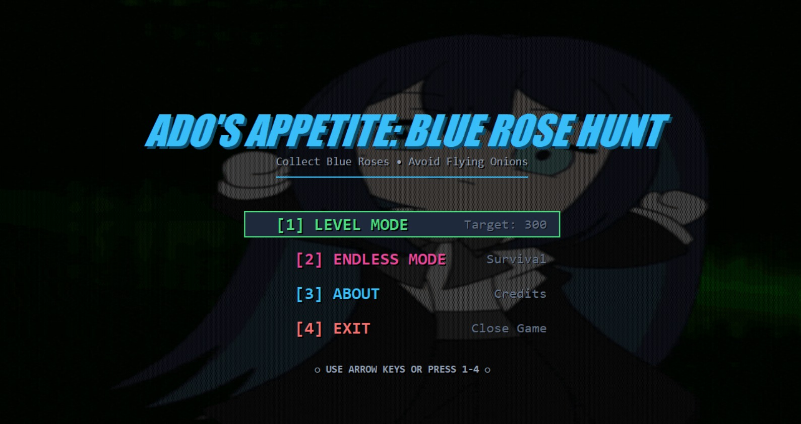
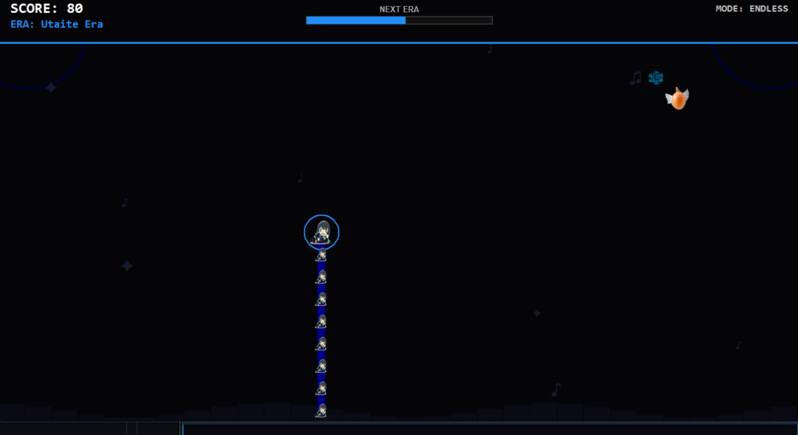
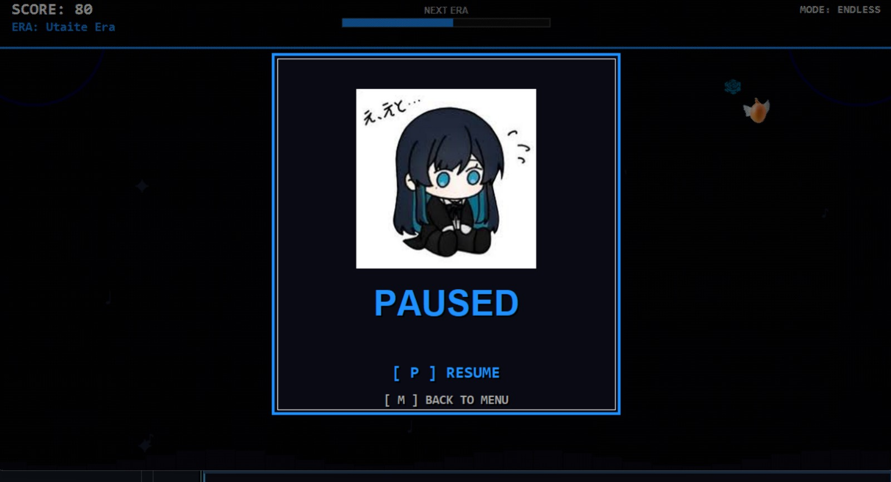
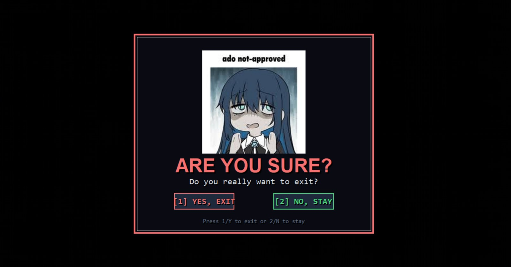
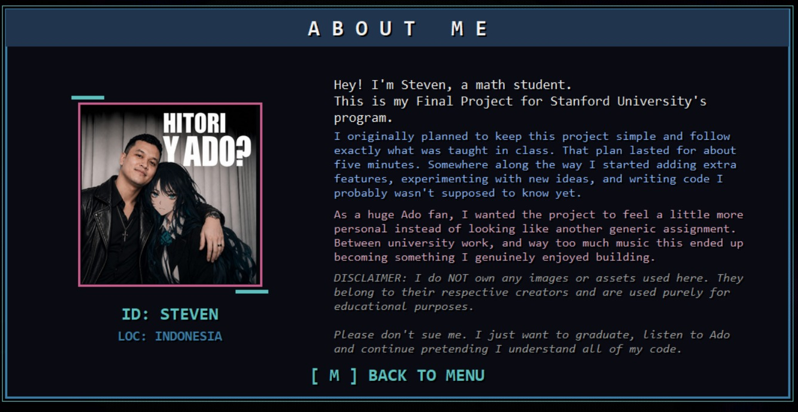

# 🌹 Ado's Appetite: Blue Rose Hunt

**ADO WORLD DOMINATION!!! 💙🌹**

*A Snake game built entirely in Python because I love Ado and wanted my Stanford Code in Place Final Project to scream "Adomin."*

[⬇️ Download Latest Release](https://github.com/Hitori75/Ado-s-Appetite/releases)

---

## 🎮 What Is This?

*Ado's Appetite: Blue Rose Hunt* is a fan-made Snake game. As an Adomin, I wanted my Final Project for Stanford University's **Code in Place** program to feel deeply personal. This isn't just an assignment; it’s a passion project built while listening to Ado's songs on an endless loop... especially *Vivarium*... during late-night coding sessions.

The original assignment requirements were fairly simple.

Unfortunately, I kept adding features.

What started as a beginner Python project somehow evolved into a game with progression systems, score multipliers, particle effects, animated menus, Flying Onions, and significantly more chaotic *gyaru* energy than Stanford ever asked for.

---

## 🌟 Evolution System

Growing longer is only part of the journey.

As your score increases, the game progresses through four distinct eras representing Ado's journey, each bringing stronger multipliers, new visuals, and increasingly chaotic gameplay.

| Era | Multiplier |
| :--- | :---: |
| 🔹 **Utaite Era** | 1× |
| 🌸 **Gira Gira Era** | 2× |
| 🔴 **Usseewa Era** | 3× |
| 🔷 **Legendary Abo** | 4× |

Reaching **Legendary Abo** unlocks the highest multiplier and turns every Blue Rose into a massive score boost. (And yes, *Abo*).

---

## ⚡ LOW HYPE Mechanic

In most Snake games, you can take your time.

Not here.

If you wait too long without collecting a Blue Rose, the **LOW HYPE** warning appears.

Keep ignoring it and your length starts shrinking automatically.

No roses.

No hype.

No mercy. 

Strictly anti-gyaru behavior.

---

## 🧅 Flying Onions

Flying Onions begin appearing as your score increases.

I will not be taking questions at this time.

If you know, you know.

---

## 🎮 Game Modes

### 🏆 Level Mode
Reach **300 points** and clear the stage.

A more structured experience for players who want a clear objective before they start screaming *Usseewa* at their screen.

### ♾️ Endless Mode
No goal.

No finish line.

Just survival.

Keep playing until the game decides you've had enough fun, or until your inner Adomin finally gives up.

---

## ✨ Features

* 🌹 Blue Rose collection system
* 🌟 Four evolution stages
* ⚡ Score multipliers up to 4×
* 💀 LOW HYPE survival mechanic
* 🧅 Flying Onion obstacles
* ✨ Particle effects
* 📳 Screen shake feedback
* 🎬 Animated splash and menu screens
* 🎮 Keyboard-friendly navigation
* 🏆 Level Mode
* ♾️ Endless Mode

---

## 📸 Screenshots

<b>Click to expand and view gameplay screenshots</b>

 

| Main Menu | Gameplay |
| :---: | :---: |
|  |  |

| Pause Screen | Exit Confirmation |
| :---: | :---: |
|  |  |

| About Me | |
| :---: | :---: |
|  | |

---

## 🎯 Controls

| Key | Action |
| :--- | :--- |
| **Arrow Keys** / **WASD** | Move |
| **Enter** / **Space** | Select |
| **P** / **Esc** | Pause |
| **M** | Return to Menu |

---

## 🚀 Download

Download the latest Windows build from the **Releases** section:

https://github.com/Hitori75/Ado-s-Appetite/releases

---

## 🎓 Stanford Code in Place

This project was developed as the final project for Stanford University's **Code in Place**, a global programming course inspired by Stanford's introductory computer science curriculum.

What began as a beginner-friendly Python assignment gradually became a passion project and an excuse to experiment with game design, visual effects, and coding like I was locked in a closet recording vocals. 

---

## ⚠️ Disclaimer

This project is a non-commercial educational project.

All rights to third-party artwork, images, characters, and media belong to their respective owners. No copyright infringement is intended. 

---

### 💙 Thanks for Playing

*"Steven"*

